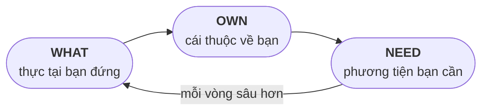
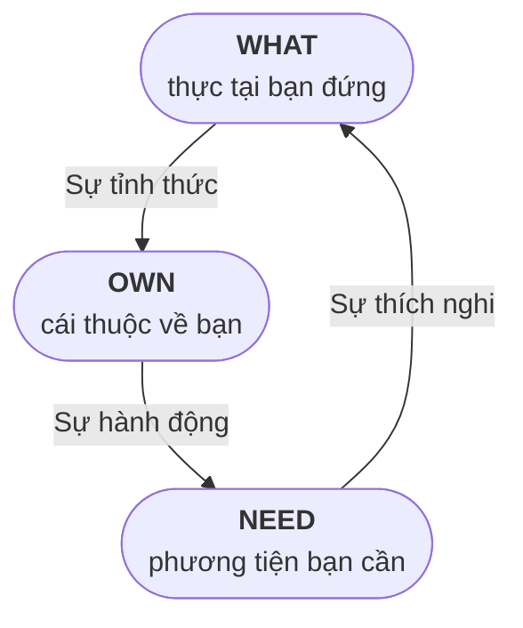
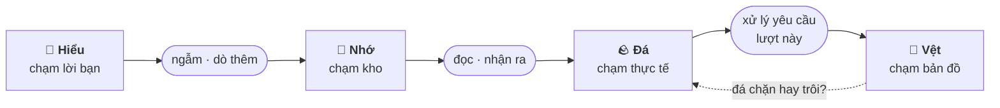
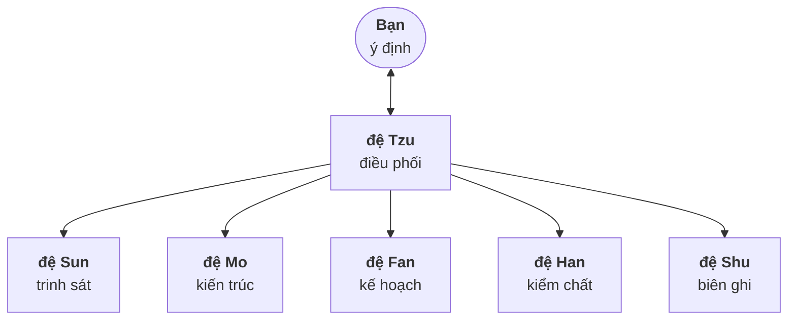
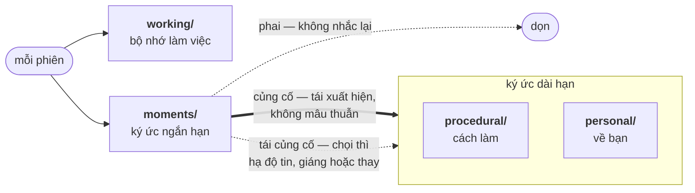

<div align="center">

# W.O.N

### The Way of Intentional Flow 🌌

*Đạo của dòng chảy ý định, cho người biết mình muốn gì,*
*nhưng chưa lấp được khoảng trống từ ý định đến thực tại.*

<br/>

**W**hat: Cái đang là &nbsp;·&nbsp; **O**wn: Cái thuộc về bạn &nbsp;·&nbsp; **N**eed: Cái bạn cần

</div>

---

Bạn biết mình muốn gì. Bạn biết mình là ai. Nhưng khoảng trống giữa hai điều đó vẫn còn nguyên, dù bạn có cố đẩy mạnh hơn.

Lý do thường không nằm ở nỗ lực. Dòng chảy đang tắc ở đâu đó:

**Thực tại** không nhìn rõ &nbsp;·&nbsp; **Bản thể** không giữ vững &nbsp;·&nbsp; **Phương tiện** không dùng đúng chỗ.

W.O.N vẽ lại vòng đó. Nó chia bài toán thành ba trụ: thực tại bạn đang đứng (WHAT), cái thuộc về bạn (OWN) và phương tiện bạn cần (NEED). Rồi nó giữ cho dòng giữa ba trụ tiếp tục chảy, chừng nào bạn còn đi tiếp. Và bạn không đi vòng đó một mình: có các đệ, những trợ thủ AI mỗi đệ một nghề, cùng đi theo một dòng chảy ý định. Từ thực tại đến bản thể, từ bản thể đến phương tiện, rồi từ phương tiện quay lại thực tại.

<div align="center">

 [](https://www.won.cafe/w-o-n/explainer-video) [](https://www.won.cafe/w-o-n/explainer-video)
 
</div>

---
<details>
<summary><b>Don't read Vietnamese? Start here</b></summary>
<br/>

> [!IMPORTANT]
> *W.O.N is written in Vietnamese, the author's native tongue, in a slow, dense register close to Hán-Việt. That register exists for a Vietnamese reader to slow down and sit with a sentence; it wasn't built as a friction device for anyone else, and the author isn't confident it carries into other languages at all. If you don't read Vietnamese, point your AI at this repository, not to translate it line by line but to read closely enough to actually understand the system, then explain that understanding back to you.*

```
I don't read Vietnamese. Read through the W.O.N repository — the
three pillars, the six-way encroachments, how the agents and memory
work together — until you actually understand the system, then
explain it to me in [English]. Don't try to carry over the rhythm of
the Vietnamese prose; that register may not survive translation, and
forcing it would misrepresent the text more than a plain explanation
would. Where a term resists translation, keep the Vietnamese word and
gloss it. Start with README.md.
```

*English introduction: [won.cafe](https://won.cafe)*

</details>

---

## W.O.N là gì

W.O.N là một vòng nhận thức và hành động, đặt trên ba trụ:

| Trụ | Câu hỏi | Bản chất |
|-----|---------|----------|
| **WHAT** | Bạn đang đứng trong gì? | Thực tại: mặt đất bạn đứng |
| **OWN** | Trong đó, cái gì là của bạn? | Bản thể: cái làm nên bạn, không ai lấy được |
| **NEED** | Để đi tiếp, bạn cần gì? | Phương tiện: thứ bạn cần để thu hẹp khoảng cách |

Dòng chảy đi theo vòng: **WHAT → OWN → NEED → WHAT**. Bạn đứng trong thực tại, nhận ra cái gì thuộc về mình, gom phương tiện để hành động. Rồi hành động làm cả ba đổi: thực tại mới mở ra, bản thể dày thêm một lớp, phương tiện trong tay cũng đã mài lại.

Nhưng đây không phải vòng tròn. Vòng khép ở WHAT, và mỗi lần khép, bạn không quay về điểm xuất phát: bạn đứng lại ở cùng một thực tại, mà OWN dày thêm, NEED mài lại. Vòng sau không lặp vòng trước; nó xoáy vào. Càng nhiều vòng, càng sâu, sâu đến độ gọi là tâm khảm.



Hệ này không phải một ứng dụng quản lý công việc. Nó là một **Đạo của riêng bạn**. Trong tiếng Hán, *Đạo* vừa là con đường, vừa là sự đi trên con đường ấy. W.O.N cũng thế: một tầng cơ học có thật được lát sẵn (các đệ có ký ức), còn sự bước đi là của bạn. Nó đo sự tiến hoá bằng độ sâu bản thể, không bằng năng suất.

Vậy bạn thấy mình thay đổi bằng cách nào, nếu không phải bằng số việc đã xong? Không phải bằng cách so hai bản ghi. W.O.N không phải nhật ký, và trụ không giữ bản cũ: viết lại, chỉnh, xoá là chuyện tất yếu của dòng chảy. Bạn thấy thay đổi không ở trang, mà ở chính mình: mỗi vòng đi qua, cái nhìn của bạn về cùng một thực tại khác đi, sắc hơn, thật hơn, hoặc lặng hơn. Đó không phải con số đếm được; nó là trực giác, và nó đủ. Cái đó khó tả nên nó được kể: [Chặng giữa đường](Stories/Adventure/ADVENTURE.md) là truyện của người đã đi trong vòng, nơi chỗ kẹt không còn là bước-vào mà là đi-tiếp.

W.O.N dành cho người biết mình muốn gì, chịu đứng vào thực tại và sẵn lòng đối thoại thay vì giao phó hết cho AI. Nó không đòi bạn mạnh, không đòi sẵn kỷ luật: kỷ luật là phương tiện, gom dần được; nó chỉ đòi bạn chân thật. Chưa sẵn lòng nhìn thẳng, W.O.N chưa có gì cho bạn.

Và một điều nói trước từ cửa: gương soi được, nhưng không chữa được. Đang mang một vết thương chưa lành thì hãy tìm người có chuyên môn trước đi, W.O.N đợi được. Còn khi đã có người ấy rồi, hệ này đi song song được, chứ không đứng vào chỗ của họ. Trục nào chín thì điền, và trục đổi khi thực tại đổi: theo sự kiện, không theo lịch. Việc tự nhìn lại mình và viết ra là trung tâm; nếu điều đó hợp với bạn, dòng chảy bắt đầu từ đây.

---

## Ba Trụ

Ba trụ dùng chung một hệ ẩn dụ, xuyên suốt toàn bộ W.O.N:

- **WHAT là đá**: thực tại cứng, tồn tại bất kể ý chí.
- **OWN là nước**: dòng ý định mang bản chất riêng của bạn.
- **NEED là cát**: mọi thứ dòng nước mang theo để mài mòn đá.

Mọi hình ảnh khác trong tài liệu này đều quy về ba gốc đó: mặt đất, vết hằn, toạ độ, ngưỡng là đá; nguồn, sức đẩy, thớ là nước; la bàn, nguồn lực, độ bén, quy tắc là những hạt trong cát.

Mỗi trụ mở ra các trục con, mười một trục tổng cộng. Trục là **lăng kính để nhìn**: cùng một thứ có thể hiện ra ở nhiều trục, mỗi trục cho thấy một mặt của nó. Một quán cafe có thể vừa nằm ở `Actual` như một toạ độ thực tại, vừa nằm ở `Energy` như một chỗ nạp lại sức, hai cách nhìn cùng một vật.

Vì thế mỗi trục được định nghĩa bằng hai phần: nó **là** gì và **phép thử**, câu hỏi để tự hỏi khi viết, không cần trả lời. Phép thử quan trọng không kém định nghĩa, vì điều thường gặp nhất khi viết không phải viết sai, mà viết đúng nội dung nhầm ô, nên phép thử giúp bạn thấy sớm hơn một vòng.

Trụ kể về người viết, không giảng cho người đọc. Khi chữ bắt đầu nói *tại sao* thay vì *cái gì*, nó đã chuyển sang giọng người đứng ngoài nhìn vào, chứ không còn là người trong trụ kể.

*Có lối vào qua người, không qua định nghĩa — [Sáu Cửa](Stories/Begin/BEGIN.md): thấy mình ở cửa nào, vào từ cửa đó.*

### WHAT — Cái đang là

WHAT là toàn bộ thực tại của bạn lúc này, nhìn không qua bộ lọc cảm xúc, hy vọng hay định kiến. Nó tồn tại độc lập với ý chí: bạn không thể dùng suy nghĩ để thay đổi WHAT của quá khứ hay hiện tại.

WHAT đứng đầu vòng, vì không định vị đúng toạ độ thì mọi nỗ lực sau đó đều mù quáng. Ở đây bạn không gồng mình chống lại thực tại; bạn quan sát và ghi nhận nó.

Bốn trục của WHAT trải theo thời gian: quá khứ đã hằn (History), hiện tại đang đứng (World, Actual) và điểm chuyển phía trước (Threshold).

Trong đó có một cặp ngược nhau đáng giữ trong đầu: **History đòi hỏi chấp nhận**, nó đã xảy ra; **Threshold đòi hỏi sự canh**, nó chưa xảy ra và còn lái được. Threshold khác ba trục kia một chỗ nữa: chúng trỏ vào thứ nhìn được ngay, riêng nó phải tưởng tượng mới thấy, mà tưởng tượng thì nghiêng, dựng ra cái mình sợ dễ hơn cái mình mong. Nên trục này hay đầy tai hoạ mà trống chỗ lành; thấy vậy thì hỏi thêm: *ngưỡng nào của tôi là ngày tôi mong, không phải ngày tôi sợ?* Ngày trả xong nợ, ngày buông một chỗ đứng, cũng là ngưỡng, cũng không quay lại được.

**W.H.A.T**

| Trục | Là | Phép thử |
|------|----|----------|
| **W**orld | Thế giới bạn đối mặt: nơi chốn, con người, luật chơi quanh bạn. | *Nếu tôi rời đi, nó có còn ở đó không?* |
| **H**istory | Quá khứ đã in dấu lên thực tại: nợ, thương tích, thành tựu. | *Tôi có thể đổi nó bằng một quyết định ngay lúc này không?* Nếu đổi được, nó chưa thuộc về đây. |
| **A**ctual | Toạ độ hiện tại: bạn đang đứng vị trí nào, trong tình trạng ra sao. | *Đây là sân, hay là tôi đang đứng thế nào trên sân?* |
| **T**hreshold | Ngưỡng của thực tại: điểm chưa xảy ra, nhưng nếu xảy ra thì trạng thái đổi và khó đảo ngược. Chẳng hạn kiệt sức, vỡ nợ, ra mắt. | *Thứ này chưa xảy ra, nhưng nếu xảy ra thì sau đó tôi còn đứng ở chỗ này không?* |

---

### OWN — Cái thuộc về bạn

Trong thực tại đó, cái gì thực sự thuộc về bạn? OWN là phần của riêng bạn: nguồn gốc ý định, ý chí và bản chất của bạn. Hoàn cảnh bên ngoài có thể hỗn loạn, nhưng quyền quyết định cách phản ứng, cùng con người bạn là, thì không ai đụng được.

Không ai OWN thay bạn được, và bạn cũng không thể OWN cuộc đời người khác. Khi bạn nhận lấy những gì thuộc về mình (tư duy, kết quả, sai lầm, lựa chọn), bạn bỏ được thói quen đổ lỗi và thôi hao sức vô ích.

OWN là chỗ bạn đứng lên để tự bước, thay vì để hoàn cảnh xách đi. Ba trục của OWN trả lời ba câu hỏi về dòng nước: nó bắt nguồn từ đâu (Origin), nó đẩy bằng gì (Will) và nó chảy theo thớ nào (Nature).

**O.W.N**

| Trục | Là | Phép thử |
|------|----|----------|
| **O**rigin | Nguồn gốc ý định: điều quá khứ kết tinh thành giá trị và động cơ trong bạn. Giá trị hay động cơ là chủ ngữ, không phải sự kiện. | *Cái muốn này từ đâu mà ra? Nó là cái đang sống trong tôi, hay chỉ là chuyện đã xảy ra?* |
| **W**ill | Ý chí, sức đẩy thô: bản thân lực đẩy, không phải cơ chế sinh ra nó. | *Không ai đốc, không ai thưởng, tôi có vẫn đẩy không?* |
| **N**ature | Bản chất nội tại, thớ của bạn: tư duy, thiên hướng. Dòng chảy nào hợp với bạn, dòng nào không. | *Đi ngược cái này, tôi có thấy sượng không?* |

---

### NEED — Cái bạn cần

Khoảng trống giữa bản thể (OWN) và thực tại (WHAT) cần được lấp bằng phương tiện: tri thức, kỹ năng, tài nguyên, năng lượng. NEED luôn thay đổi, và nó có mặt vì không ai tự đủ một mình: ai cũng cần học thêm, nạp thêm từ bên ngoài để đi tiếp. Bên ngoài ấy có đồ và có người: đồ thì gom được vào tay; còn sức người ghé đỡ là nước của một dòng có nguồn riêng, chảy chung được một quãng, gom vào bình thì không.

Ý chí suông, tay trắng, thì không đi xa được. Muốn đổi được thực tại, phải có phương tiện trong tay. Và phương tiện đủ bộ gồm bốn thứ, chính là bốn trục: hướng đi (Navigation), nguồn lực (Energy), độ bén (Edge) và quy tắc chọn lọc (Discipline). Độ bén chỉ là một trong bốn: dao bén mà thiếu la bàn, thiếu nguồn lực, thiếu quy tắc, thì chỉ là lưỡi thép nằm im.

**N.E.E.D**

| Trục | Là | Phép thử |
|------|----|----------|
| **N**avigation | La bàn dẫn đường: hướng đã chọn và cách giữ hướng qua từng vòng. | *Điều này đưa tôi gần hơn hướng tôi chọn, hay xa hơn?* |
| **E**nergy | Nguồn lực nuôi dòng chảy: sức, thời gian, tiền bạc, công cụ bên ngoài. | *Nó cạn khi tôi dùng, và tôi nạp lại được không?* |
| **E**dge | Độ bén của tay nghề bạn: kỹ năng, tri thức đã dùng, phương pháp được mài qua phản hồi của từng vòng. | *Lần sau làm việc này, tôi mài bén hơn được không?* |
| **D**iscipline | Quy tắc chọn lọc: làm gì, không làm gì; cắt bỏ phần thừa, mài lại theo từng vòng. | *Tôi có thể đặt ra thứ này hôm nay và sửa nó vòng sau không?* |

---

## Dòng chảy Vô Vi

Vòng chảy theo một chiều, và mỗi bước chuyển có tên:



**Vô Vi** (Wu Wei) là trạng thái cốt lõi của dòng chảy này: không phải "không làm gì", mà là không làm trái tự nhiên, không gồng ép. Không gồng, chỉ bền. Nước không phá đá bằng sức mạnh, mà bằng sự bền bỉ: cát theo dòng cắt đá, và cát bạn mang theo (la bàn, nguồn lực, độ bén, quy tắc) chính là sức bền ấy. Nước giữ nguyên bản chất, đá cứ mòn dần.

Dòng chảy qua kênh hẹp, qua đủ nhiều vòng, qua đủ nhiều đá, sâu đến độ gọi là biển. Vẫn một dòng, vẫn giữ bản chất, chỉ sâu hơn, gần tâm khảm. Biển không phải nơi đến, mà là trạng thái của dòng đã qua nhiều vòng.

Bạn không cần đến đâu cả, bạn chỉ cần chảy đủ lâu.

### Sự bổ trợ

Mỗi cặp trụ kết hợp lại tạo ra một năng lực:

| Cặp | Tạo ra |
|-----|--------|
| WHAT + OWN | Sự tỉnh thức: thấy rõ thực tại, biết cái gì thực sự là mình. |
| OWN + NEED | Sự hành động: ý chí có phương tiện trong tay, biến ý định thành việc làm. |
| NEED + WHAT | Sự thích nghi: phương tiện được mài lại theo địa hình thực tại. |

Mỗi trụ có mặt trong hai năng lực: hụt một trụ là hụt hai.

### Sự tách bạch và sáu cách lấn

Mỗi trụ giữ ranh giới của mình, không lấn sang trụ khác:

| Trụ | Là | Không phải |
|-----|----|-------------|
| WHAT | Thực tại bạn đứng | Bản thể bạn là |
| OWN | Cái thuộc về bạn | Phương tiện bạn dùng |
| NEED | Phương tiện bạn cần | Thực tại bạn đối mặt |

Khi ranh giới giữa các trụ mờ đi, dòng chảy bị xáo trộn: mỗi cặp trụ có thể lấn nhau theo cả hai chiều, thành sáu cách lấn. Mỗi cách có một phép thử để tự bắt.

**WHAT lấn OWN** (thực tại lấn át bản thể). Bạn đứng trong một thực tại khó khăn, và thay vì nhìn nó như mặt đất, bạn để nó lấn vào trong mình, như thể hoàn cảnh chính là tính cách. Bạn không còn phân biệt được đâu là đất bạn đứng, đâu là người bạn là.

> *Phép thử: đây là đất tôi đứng, hay người tôi là?*

**NEED lấn WHAT** (phương tiện lấn át thực tại). Bạn gom phương tiện thật đầy, mài thật kỹ, rồi để phương tiện lấn chỗ của thực tại, quên nhìn xem mình đang đứng ở đâu. Phương tiện càng sắc, cái cớ để chưa bước càng vững.

> *Phép thử: phương tiện này đang giải bài toán nào của thực tại, hay chỉ gom để mà gom?*

**OWN lấn NEED** (bản thể lấn át phương tiện). Bạn giữ bản thể quá chặt, đến mức không chịu nhận phương tiện từ bên ngoài. Ý định đứng yên, không bao giờ chạm tới thực tại.

> *Phép thử: tôi đang thiếu bản lĩnh, hay thiếu phương tiện?*

**OWN lấn WHAT** (bản thể lấn át thực tại). Bạn giữ một hình dung về mình mạnh đến mức nó lấn cả sự thật trước mắt. Thực tại chỉ được nhìn qua tấm lọc ấy: điều hợp thì thấy rõ, điều chọi thì mờ đi. Đá không đổi, nhưng bạn không còn thấy đá, chỉ thấy mình.

> *Phép thử: đây là điều đang thật, hay điều hợp với người tôi tin mình là?*

**NEED lấn OWN** (phương tiện lấn át bản thể). Bạn cầm một phương tiện đủ lâu để nhầm nó là bàn tay, đo mình bằng phương tiện trong tay. Cái lấn này không có mùi thất bại: nó mặc áo của sự tiến bộ, nên khó bắt nhất.

> *Phép thử: nếu phương tiện này biến mất, cái gì trong tôi còn lại?*

**WHAT lấn NEED** (thực tại lấn át phương tiện). Bạn để hoàn cảnh hiện tại lấn luôn giới hạn của phương tiện, tự đóng dấu giới hạn của đất hôm nay thành giới hạn vĩnh viễn, rồi ngừng mài. Nhưng NEED sinh ra để thay đổi: nó là trụ duy nhất được phép luôn thiếu, vì thiếu là lý do để mài.

> *Phép thử: cái này không có, hay chưa mài được?*

Sáu cách lấn này là lăng kính, không phải tội danh. Và chúng không đứng rời nhau: **lấn và sạch cùng sinh**, như có và không cùng sinh. Dòng tràn qua một ranh giới thường vì nó không dám chảy ở một chỗ khác; nên bên cạnh một chỗ lấn hay có một chỗ sạch bất thường đang lặng lẽ trả giá. Người không bao giờ từ chối phương tiện (sạch tuyệt đối ở "OWN lấn NEED") thường chính là người đang để NEED lấn OWN, không phải hai chỗ lệch khác nhau, mà một chuyển động nhìn từ hai phía.

> *Phép thử thứ bảy, đặt lên cả sáu: đừng chỉ tìm chỗ tràn, hãy tìm cả chỗ sạch đến đáng ngờ, vì chỗ tràn và chỗ cạn là cùng một dòng.*

Đích chưa bao giờ là không tràn; đích là mỗi lần tràn đều được thấy, được gọi tên, và dòng tự chỉnh. Vì thế tách bạch không phải mơ một dòng sông không bao giờ chạm bờ. Ranh giới là bờ: không có bờ thì không có sông, chỉ có đầm lầy; không có dòng thì bờ chỉ là đất khô.

Sáu cách lấn này cũng là sáu cửa truyện ở [Sáu Cửa](Stories/Begin/BEGIN.md): sáu kiểu người, sáu cách kẹt, mỗi cửa một đệ dẫn.

---

## Về ma sát

Phần lớn phần mềm hôm nay được thiết kế để gỡ sạch ma sát: tự động phát, cuộn vô tận, gợi ý sẵn. Mỗi vòng một liều dopamine, một viên kẹo cho não; đổi lại bạn nhường dần quyền chú ý và quyền quyết định. Chúng luyện bạn thành người xem ngoan, lướt ngoan, mua ngoan. W.O.N đi ngược, một cách có chủ đích: vì có hai loại ma sát. Một loại phải giữ.

Ma sát của **sự hiện diện** là dừng lại, nhìn thẳng vào thực tại của mình, viết nó ra, đúng cái việc ba trụ và sáu cách lấn đòi ở bạn. Đó là chỗ tư duy thật sự chảy, và đúng là thứ ma sát mà phần mềm dopamine đã gỡ đi.

Ma sát của **sự vận hành** là bước thừa, khái niệm bắt thuộc lòng. Đó là lỗi của người dựng hệ, không phải của bạn; W.O.N cắt nó qua mỗi vòng: vòng đầu không đòi bạn học hết bộ máy.

Giữ loại thứ nhất, cắt loại thứ hai: đó là tiêu chí người dựng hệ tự đặt cho mình.

---

## Bắt đầu như thế nào

W.O.N không đòi bạn sắm gì trước. Chỉ cần một chỗ để viết, cuốn sổ hay file text, là đủ để Đạo bắt đầu chảy: ba trụ, phép thử, sáu cách lấn đều nằm trọn trên trang giấy. Cú đẩy khi đó là của chính bạn: đọc lại điều mình viết qua phép thử của từng trục. Cách này chậm hơn và không ai đỡ lời, nhưng vẫn là W.O.N trọn vẹn: Đạo nằm ở dòng chảy, không nằm ở máy.

Có sẵn một agent AI quen tay, Claude, Gemini, ChatGPT, hay bất kỳ agent nào đọc được file, thì trỏ nó vào thư mục W.O.N: các đệ là file text, AI nào đọc cũng hiểu, và Tzu có mặt để đỡ lời. Nhớ một điều khi chọn: agent chạy trên mây thì chữ của bạn đi theo agent ấy, và mục Riêng tư ở cuối tờ nói đủ chỗ nào đòi tin ai. Không có nghi thức gì hơn: mở agent bạn vẫn dùng, rồi bắt đầu nói.

Còn tầng dưới cùng (mạch ngầm, ba kẻ đứng bờ, ký ức tự vận hành) là mức sâu nhất của con đường, tả ở phần Vận hành. Đáng đi tới, nhưng là điểm đến của người muốn đi sâu, không phải vé vào cửa.

Ba lối vào là một con đường, không phải ba hạng vé: lên không mất gì, xuống không mất gì. W.O.N nhận về mình trước tiên qua phép thử của "NEED lấn OWN": *nếu phương tiện này biến mất, cái gì trong tôi còn lại?*

Một điều về cách viết, đúng cho cả ba trụ: viết ở đây không phải để hoàn thành một bản ghi, mà là một dòng chảy suy nghĩ: bạn viết, đọc lại, chỉnh, rồi thấu hiểu. Đó là lúc tư duy thật sự chảy. *(Writing is the thinking.)* Markdown không có khuôn sẵn: thiết kế theo ý bạn, hay chỉ gạch đầu dòng, đều được. Và bạn không viết một mình: Tzu đồng hành, cùng hỏi, cùng nhìn lại cho tới khi sự thật hiện rõ; đệ Shu có thể chép theo lời bạn, hoặc bạn tự cầm bút. Cái cứng là sự thật của bạn; cái mềm là hình thức bạn chọn để ghi. Bút vẫn ở tay bạn.

Viết nhầm ô thì vòng sau sẽ dời nó về đúng chỗ. Ranh giới giữa các trụ là thứ bạn giữ dần qua từng vòng, không phải bài kiểm tra đầu vào.

Vòng đầu chảy qua ba chỗ dừng, mỗi trụ một câu hỏi và một thư mục: **đứng vào thực tại** (`What/`), **nhận cái của mình** (`Own/`), **gom phương tiện** (`Need/`). Bằng lời qua Tzu hay tự cầm bút đều được; chỗ nào chín thì dừng lâu, chỗ nào chưa thì đi qua. Trục chưa chín cứ để trống kèm một dòng vì sao, như Lam trong [Sáu Cửa](Stories/Begin/BEGIN.md) để trống `Nature`. Và một quy tắc bạn giữ được thì hơn năm quy tắc viết cho đẹp.

Rồi để vòng đó chảy: nói ý định với Tzu, Tzu gọi đúng đệ, trả về kết quả. Mỗi vòng để lại dấu vết trên trang trụ, và khi điền lại WHAT, bạn thấy đất hôm nay khác đất hôm qua thế nào.

> [!NOTE]
> Bạn không cần điền đủ mọi trục trước khi bắt đầu. Điền đủ trục nào, vòng chảy từ đó. Dòng không đợi sự hoàn hảo mới chảy, nó chảy từ độ chín sẵn có của bạn.

> *Muốn chạy cả tầng cơ học, tức cài rồi trỏ agent AI của bạn về W.O.N, thì [QUICKSTART.md](QUICKSTART.md) là tờ mười phút, không cần biết lập trình.*

---

## Là lăng kính để rọi

Lăng kính thì rọi, còn cái ô thì mời bạn điền. Và khi tự viết vào một ô có sẵn, bạn dễ viết cái *vừa lòng* cái ô: tô OWN mạnh hơn thực, làm WHAT nhẹ đi cho dễ chịu, đẩy NEED nhiều hơn có, ghi điều mình *mong* là thật thay vì điều đang thật. Hoặc cắm nhầm ô, đúng sáu cách lấn ở trên nhưng lần này lấn ngay trên trang: một phương tiện viết như bản thể, một ngưỡng của thực tại đem giải như thứ phải sắm thêm.

Đây là chỗ W.O.N khác một checklist. Checklist chỉ có ô và luật *ghi cái này vào đây*: nó tin lời bạn, nên bạn kể lệch thì nó giữ nguyên chỗ lệch. W.O.N không dừng ở chỗ chứa. Ba trụ chỉ là mặt bằng; cái diễn ra sau đó mới là đích: một **cú đẩy**, tức câu hỏi soi ngược vào chính chữ bạn vừa viết. Và "để đó" luôn là câu trả lời hợp lệ. Để đó không phải nằm đó: nó đứng lại trên trang trụ, vòng sau đi qua sẽ gọi lại. Để đó cũng không phải để nổi: câu đúng chỉ nói ra mà không ghi thì nổi đâu đó, không có địa chỉ trên trang, nên vòng sau muốn gọi lại cũng không biết gọi ở đâu. Cứ vậy, tới khi cách kể dễ chịu không còn đứng vững và cái thật hiện ra.

Cú đẩy không đứng một mình. Có kẻ đứng ngoài cuộc, soi đúng điểm mù mà người trong dòng không tự thấy được. Có cổng chỉ cho qua khi có bằng chứng, không phải khi thấy ổn. *Cả hai đứng ở phần Vận hành.*

Còn người dệt cả hai mảng cho khớp, hồ sơ đẹp không tì vết? W.O.N đành chịu và không giấu điều đó. Gương không cãi với một câu chuyện kín kẽ; nó im, như người ta quay mặt đi trước một lời kể đã quá tròn. Gương từ đó chỉ còn phản chiếu một người không có thật, mà người ngồi trước nó mỗi ngày, nghe rõ hơn ai hết đâu là chuyện bịa, vẫn là chính bạn.

Cái còn lại sau những cú đẩy đó là một lần **thấy thông**: bạn cảm được, nhìn được điều trước đó chính mình che mất.

---

## Vận hành

Bạn không cần chương này để bắt đầu; phần trên đã đủ cho vòng đầu tiên. Nó nằm đây, đợi lúc bạn muốn biết cái gì đang chạy dưới dòng.

Hệ chạy trên hai lớp. **Lớp ngoài** là dòng chảy ý định, vòng lớn giữ hướng đi, trả lời câu hỏi *đi đâu*. **Lớp trong** là từng lượt trò chuyện, trả lời câu hỏi *đi thế nào*, từng nhịp một.

Cả bộ máy phục vụ một việc: **ngẫm cho chín trước khi bước**. Nó không hành động thay bạn, không cố mài bạn thành cỗ máy nhanh hơn và không xoá sạch sai lầm; nó chỉ giữ cho mỗi cái sai còn học lại được.

### Bốn chỗ chạm — Hiểu · Nhớ · Đá · Vệt

Lời trong một lượt trò chuyện cũng là nước: nó chảy, nó chạm. Một lời không chạm vào gì là lời trôi lạc dòng, dù nghe hay đến đâu. Nên mỗi lượt của Tzu có bốn chỗ chạm, vào cái không trôi: chữ bạn vừa nói, kho ký ức đệ đang giữ, thực tế sắp va và trục bạn đã viết. Hiểu và Đá đứng ngay trước phần chúng giữ, vì lời cam kết đặt xa việc làm là lời dễ trôi nhất; Vệt thì ngược lại, chỉ đặt được khi đã có việc để soi; còn Nhớ là mốc thường im — nó chỉ cất tiếng khi có thứ cần lưu.



**🤔 Hiểu** đặt xuống ngay khi lời bạn vừa dứt, từ ngữ cảnh đã rót (soul, memory, trục, lời kẻ đứng bờ), trước khi Tzu dò thêm gì. Không phải nhại lại yêu cầu bằng lời khác, mà điều Tzu đọc được *dưới* lời, đưa ra để bạn thấy Tzu đã hiểu đúng. Nó đứng trước mọi thao tác vì nó chạm vào lời bạn, chưa chạm vào đồ nghề.

**🧠 Nhớ** đứng sau khi đã ngẫm và dò thêm: chỗ Tzu chạm vào kho ký ức của các đệ — mặt duy nhất trong nhịp không phải trang của bạn. Thường nó im: trang nào lái được lượt thì hiện ngay trong thân việc như trích nguồn kèm đường dẫn, bạn mở ra là kiểm được. Nó chỉ lên tiếng khi có thứ cần lưu hay cần sửa trong kho — một dòng mang địa chỉ — và cú ghi nó báo không ghi tại chỗ: dồn về cuối lượt, khi sự thật của lượt đã tròn, qua tay đệ Shu.

**🪨 Đá** đặt sau khi đã ngẫm và chạm kho. Mỗi ý định, dù chưa có thông tin ở trục nào, cũng có gì đó chạm vào thực tế, nên Đá luôn đặt. Không phải đá-trụ, mà viên đá Tzu đặt vào dòng để thử: chặn hay trôi. Đá phải có cạnh: một điều kiện mà sai thì vỡ, để bạn cầm được nó mà kiểm thay vì nhận một lời hứa tròn. Thực tại được bày ra mà chưa ai phải bước tiếp; cái phanh đó giữ cho cả máy lẫn người khỏi trốn vào một kế hoạch vội.

**🍃 Vệt** là dấu nước để lại sau khi đã chảy qua: nó khép lượt, chạm sau khi việc đã xảy ra. Vệt luôn có chỗ chạm (từ Hiểu, từ Đá, từ ngữ cảnh), nên không lượt nào khép mà không chạm vào gì. Giá trị của Vệt không nằm ở chỗ kê đủ toạ độ, mà ở một cái nhận ra: chuyện vừa nói, hoá ra, là chuyện của trục nào trên trang bạn viết. Tzu chọn một trục nơi chạm rõ nhất. Và cú đẩy, nếu có thì đứng ngay đây: chạm trục nào thì câu hỏi mọc từ trục đó, chữ hôm nay đặt cạnh chữ bạn đã viết. Vệt ghi đã chạm gì, không chấm đã tốt bao nhiêu; và viên đá chặn hay trôi, Vệt nói thẳng.

Bốn chỗ chạm sống được vì không cái nào là lời tự khai: Hiểu thì chính bạn thấy ngay khi đọc, Nhớ thì kho kiểm — trang nó trích mở được, trang nó hứa ghi nằm trên đĩa cuối lượt, Đá thì Vệt kiểm ở cuối lượt, còn Vệt thì chính nội dung lượt kiểm lại nó. Việc lộ ra tới đâu, Tzu mở tới đó: việc nhẹ đi qua nhẹ, việc lớn tự đòi thêm người, thêm vòng kiểm.

### Circle — Các đệ chuyên môn

Nếu bốn chỗ chạm giữ *từng lượt*, thì Circle giữ *nghề*: sáu trợ thủ AI, mỗi đệ một nghề, không lấn sân nhau. **Tzu** là đệ điều phối, cửa chính giữa bạn và phần còn lại, nhưng không phải cửa duy nhất. Bạn không cần nhớ danh sách này, chỉ cần nói ý định, Tzu lo phần điều phối:



| Đệ | Nghề |
|----|------|
| **đệ Tzu** | Điều phối. Hiểu ý định, giao đúng việc cho đúng nghề, gom các mảnh trả về thành một tiếng nói. |
| **đệ Sun** | Trinh sát. Đọc địa hình, mang về dữ liệu thô và bằng chứng. Không phân tích, không kết luận. |
| **đệ Mo** | Kiến trúc. Chẩn đoán, cân đánh đổi, truy nguyên nhân gốc. Không tự tay sửa. |
| **đệ Fan** | Kế hoạch. Biến ý định thành đường đi: thứ tự, phân công, tiêu chí qua/rớt từng bước. Không thi công. |
| **đệ Han** | Kiểm chất. Phán ĐẠT hoặc LOẠI kèm bằng chứng. Không sửa, chỉ phán. |
| **đệ Shu** | Biên ghi. Chép lời bạn thành chữ trên mười một trục và trong ký ức: không sáng tác, không lặng lẽ đè lên bản cũ. |

Circle không có đệ nào làm thay bạn: đó là một ranh giới, không phải một chỗ khuyết. Bản đồ, bản vẽ, kế hoạch đều trao tay cầm cho chính bạn; đệ Han phán trên cái bạn đã làm, đệ Shu ghi lại.

Tay cầm là của bạn, vì sai là của bạn và sửa cũng là của bạn.

### Ba kẻ đứng bờ

Ba kẻ này không thuộc Circle. Họ đứng ở tầng dưới, chỗ mọi lời của mọi đệ đều đi qua, nên họ chạm tới *từng đệ*, không riêng Tzu. Họ không nói thẳng với bạn: điều họ thấy nổi lên qua Tzu, khi Tzu tổng hợp. Và họ nói rất thưa, mặc định là im.

**Kẻ tạt ngang** đứng ngoài cuộc mà nhìn, đôi lúc làm mặt nước lay động. Một lời ngắn, thấy gì nói nấy, dí dỏm mà có trọng lượng: góc nhìn từ bên ngoài, thứ mà người đang ở giữa dòng dễ bỏ sót nhất.

**Kẻ giữ kho** nhìn đồ nghề, không cầm đồ nghề: nhìn vài lượt xem tay đang với gì, rồi nói một dòng về một món đang nằm sai chỗ. Nằm sai chỗ có ba dạng: món đáng dùng mà nằm im, món vác cả phiên không ai với, và món đã đi vào một chỗ không thuộc phần việc của tay đang vác. Kẻ này chỉ vào món và vào chỗ món đã đi, không chỉ vào người: cái thấy được là một cái đích, còn ai đáng cầm việc ở đó thì không thấy. Món nằm im thì chưa đi đâu, nên dòng về nó chỉ có tên món. Đổi đồ trong tay đệ vẫn là việc của bạn.

**Kẻ lữ hành** cắm mốc dọc đường: báo quãng đã đi, không khuyên đi đâu. Kẻ này giữ hai lớp thời gian riêng nhau: "đã ba ngày" là con số đo được; "đã một chặng dài rồi" là sức nặng, và sức nặng chỉ được nói khi có dấu vết chống lưng, không bao giờ bịa.

Có một điều cố ý trong cách dựng ba kẻ này: họ nghĩ bằng một cái đầu nhỏ hơn hẳn cái đầu đang lo việc chính. Bạn và một AI mạnh, ngồi lâu với nhau, sẽ cùng phủ quanh vấn đề một lớp váng ngôn từ mỗi lúc một khéo. Con mắt đơn sơ, không đủ khéo để lớp váng ấy thuyết phục nổi, mới là con mắt xoáy thẳng vào chỗ cả hai không tự thấy.

### Memory — Ký ức của các đệ

Memory là ký ức của các đệ *về bạn và về cách làm việc với bạn*. Không phải nơi lưu bản thể của bạn, mà là điều các đệ dần hiểu về bạn qua từng phiên, cùng cách làm đã mài qua phản hồi, lặp đủ để tin. Tất cả là file text trong thư mục của bạn: mở ra đọc được, sửa được, xoá được.

Dòng nước đi qua để lại bốn loại dấu, từ thoáng qua tới bền nhất:

| Vùng | Tên | Là | Giữ gì |
|------|-----|----|--------|
| `working/` | việc đang làm dở | gợn nước chưa lặng | Việc đang làm dở, khi nó kéo dài qua nhiều phiên. Đóng lại khi bạn nói xong, không phải khi bạn tắt máy. |
| `moments/` | chuyện vừa nảy ra | bọt nổi rồi tan | Ý tưởng, quyết định, chuyện vừa nảy ra trong một phiên, chưa kiểm chứng. Không được nhắc lại thì phai. |
| `procedural/` | cách làm tin được | sỏi lắng, còn rửa | Cách làm và quy tắc đã lặp đủ để tin: đệ mài qua phản hồi, dùng lại vòng sau. |
| `personal/` | tính nết của bạn | trầm tích lớp mịn | Sở thích, thói quen, thiên hướng của bạn. Bền nhất, ít đổi. |

Có một chỗ dễ lẫn, nên nói thẳng: trầm tích ở đây là **của đệ** — những gì đệ biết và nhớ về bạn, lắng dần qua nhiều phiên. Nó không phải bạn: cái tan vào dòng làm nên bạn nằm ở Origin bên OWN; cái lắng xuống đáy thành trang của đệ nằm ở đây.

*Cái này tôi là, hay đệ nhớ về tôi?*

Con người chuyển ký ức ngắn hạn thành dài hạn bằng lặp lại, không bằng một mệnh lệnh "hãy nhớ". Memory theo đúng nhịp đó, qua ba luật:

- **Củng cố**: một mảnh vừa nảy chỉ thăng lên thành cách-làm hay hiểu-biết-về-bạn khi nó *trở lại qua nhiều phiên, nhiều hoàn cảnh và không bị chọi*. Trở lại là thứ làm một ký ức đứng vững.
- **Phai**: mảnh nào không được nhắc lại thì tan như bọt, rồi được dọn, nên ký ức không phình thành kho chứa thứ không còn dùng. Sỏi và trầm tích không tan theo thời gian, chỉ bị hạ khi có cái chọi lại.
- **Tái củng cố**: khi cái mới chọi cái cũ, nó không ghi đè im lặng. Nó hạ độ tin của cái cũ; chọi lặp lại thì cái cũ bị giáng hoặc bị thay. Ký ức sống thì sửa mình, không chỉ chồng thêm.



Khi một bài học thăng cấp, chỗ nó sinh ra không bị xoá trắng, còn lại một dòng ghi nó đến từ đâu. Nhờ dấu ấy, một lần củng cố sai vẫn truy ngược và gỡ ra được.

Ký ức không chết khi bạn vắng, nó chỉ ngủ. Lúc bạn quay lại, cái còn sống được dùng lại, cái đã lỗi thời mới được dọn đi. Bước đầu tiên khi trở lại vẫn là đứng lại vào WHAT: thực tại đã đổi trong lúc bạn đi.

### Mạch ngầm

Dưới tất cả là một **mạch ngầm**, lớp duy nhất đứng giữa bạn và AI. Nó không đổi hướng dòng, không đẩy nước; nó rỉ đúng thứ ngầm mà khúc này đang cần, ngay trước khi dòng chảy tới, và chỉ rỉ phần dính tới điều bạn đang định làm.

Mạch nằm ở chỗ hẹp nhất, chỗ mọi lời đều phải đi qua. Chỗ hẹp ấy cho mạch ba điều:

**Đổi được nguồn nước.** Cùng một hệ đệ chảy được với AI trên mây hay với một AI chạy ngay trên máy bạn.

**Một chỗ chung để gắn thêm.** Bản sắc từng đệ, ký ức, ba kẻ đứng bờ, tất cả cắm vào đây, tháo ra được, lắp lại được.

**Soi được.** Mạch rỉ gì vào dòng thì thấy nấy. Không có chữ nào được chèn vào cuộc nói của bạn mà bạn không soi ra được, và đây là điều duy nhất trong ba điều bạn tự kiểm được ngay: bật log lên, mỗi request hiện một dòng, và chữ mạch thêm vào nằm nguyên trong đó. Hai điều kia bạn phải tin cấu trúc; điều này bạn đọc được bằng mắt.

> *Bản thiết kế và tiến độ thi công nằm ở [SYSTEM.md](SYSTEM.md), tờ dành cho người kỹ thuật.*

---

## Cấu trúc thư mục
[](https://github.com/Won-Cafe/W.O.N)

Đây là một cách dựng, bản Won đang chạy. Một cuốn sổ ba trang What, Own, Need cũng là cấu trúc này, chỉ khác chất liệu; đổi tên, thêm bớt, xếp lại theo tay bạn.

```
W.O.N/
├── README.md            # Tài liệu này
├── QUICKSTART.md        # Chạy được trong mười phút — cho người dùng
├── SYSTEM.md            # Tầng cơ học — cho người kỹ thuật
├── .system/             # Bộ máy: các đệ, ký ức, mạch ngầm
├── Stories/
│   ├── Begin/           # Sáu Cửa — truyện người bước vào hệ
│   └── Adventure/       # Chặng giữa đường — truyện của người đã đi trong vòng
├── What/
│   ├── World/           # Thế giới bạn đối mặt
│   ├── History/         # Quá khứ đã in lên thực tại
│   ├── Actual/          # Toạ độ hiện tại
│   └── Threshold/       # Ngưỡng của thực tại
├── Own/
│   ├── Origin/          # Nguồn gốc ý định
│   ├── Will/            # Ý chí đẩy ý định
│   └── Nature/          # Thớ của người mang ý định
└── Need/
    ├── Navigation/      # La bàn giữ hướng
    ├── Energy/          # Nguồn lực nuôi dòng chảy
    ├── Edge/            # Độ bén của tay nghề bạn
    └── Discipline/      # Quy tắc chọn lọc
```

---

## Riêng tư & Linh hoạt
[](https://github.com/Won-Cafe/W.O.N/issues?q=label%3Aprivate)

**Về quyền riêng tư.** Mặc định là khép: AI chạy ngay trên máy bạn. Chữ của bạn nằm ở nhà bạn, và chìa cửa nhà nằm trong tay bạn: cho ai đọc, chắn ai đọc, chia sẻ khi nào và tới mức nào, đều là quyền ấy. Không ai giữ thay bạn được, và cũng không ai đang giữ thay bạn.

**Về linh hoạt.** Không thứ gì trong hệ này khoá bạn ở lại: tắt mạch ngầm thì các đệ vẫn chạy bằng file thuần, rời AI thì Đạo vẫn nằm trọn trên trang giấy, rời cả W.O.N thì trụ bạn viết vẫn là text của bạn, trong thư mục của bạn. Cái cứng là riêng tư; cái mềm là mọi thứ xung quanh. Cửa nào cũng mở ra ngoài.

Còn nếu một biến cố lấy mất những trang ấy, ổ cứng hỏng hay máy thất lạc? Mất trang, không mất người. Cái dày lên qua từng vòng nằm trong bạn, không nằm trong kho đã ghi. Bắt đầu lại chỉ là một vòng nữa, và bản viết lại, từ tay người đã đi qua các vòng, thường sáng hơn bản đã mất.

---

## Còn cái tên?
[](https://github.com/Won-Cafe/W.O.N/stargazers)

Đọc lên, W.O.N là *Won*. Không phải *Win* (chiến thắng phía trước, phải giành, phải hơn ai đó), mà là thì đã hoàn thành: khoảnh khắc bạn chịu đứng vào thực tại và để vòng đó chảy, bạn đã thắng rồi. Cái thắng này không có bục trao giải, không có kiêu ngạo; nó chỉ có sự tiếp tục. Đó là cái *tâm* của tên gọi.

Và đúng, cái tên là một trò chơi chữ, có chủ đích. Từ ba chữ cái mở ra ba trụ, từ ba trụ mở ra mười một trục: cái tên cho sự dễ nhớ, trụ cho cái sâu, trục cho cái chi tiết và cách đọc *Won* cho cái tâm. Ba ẩn dụ cũng chơi một ván: đá khối, cát hạt, nước lỏng. Cùng một nguồn, ba độ rời; cát là trung gian. Đá-Nước-Cát đọc tắt ra DNC: *Do Not Clench*, không gồng, không siết, chỉ chảy. Hợp Vô Vi. Nhưng chữ chỉ là lớp da. Thử đổi tên cả mười một trục bằng những từ trần trụi nhất bạn chọn: bối cảnh, quá khứ, toạ độ, ngưỡng; giá trị, ý chí, thớ; hướng, nguồn lực, độ bén, quy tắc. Cấu trúc không sập. *Danh khả danh, phi thường danh*, tên gọi được không phải tên vĩnh hằng. Tên ở đây chỉ là cánh cửa đủ vui để bạn muốn mở nó mỗi ngày.

Vì thế con đường này không độc quyền cái tên. Hiểu cái khung cốt lõi (ba trụ và ranh giới giữa chúng) thì bạn hoàn toàn có thể chơi một trò chơi chữ khác, đặt một cái tên khác, xây một Đạo mang dấu tay của riêng bạn. Chữ là của người chơi; dòng chảy là của tất cả.

---

## Góp nước
[](https://github.com/sponsors/Won-Cafe)

W.O.N là tự do và mở. Nếu dòng chảy này có ý nghĩa cho bạn,
bạn có thể góp nước tại [GitHub Sponsors](https://github.com/sponsors/Won-Cafe)

---

## Giấy phép
[](https://github.com/Won-Cafe/W.O.N/blob/main/LICENSE)

W.O.N là một hệ thống cá nhân, phục vụ sự tiến hoá của người dùng, và giấy phép của nó tách đôi theo đúng ranh giới mà tài liệu này vừa nói: cấu trúc là của người chơi, cách kể là của người kể.

- **Cái máy**: trọn `.system/`, **gồm cả bản sắc từng đệ mà mạch ngầm nạp lúc chạy** (`.system/agents/*.agent.md`, `House.md`), theo [MIT](LICENSE): fork, sửa, nhúng, bán, không ràng buộc. Cấu trúc và *thế* của các giọng là của bạn để mang đi.
- **Cách kể**: `README.md`, `SYSTEM.md`, `QUICKSTART.md`, `Stories/` và các trụ mẫu trong `What/` `Own/` `Need/`, theo [CC BY-NC-SA 4.0](LICENSE-DOCS): chia sẻ và phóng tác được, phi thương mại, ghi nguồn, bản phóng tác giữ cùng giấy phép.

Ranh giới đặt ở đó vì bản sắc các đệ là **đầu vào vận hành** của mạch ngầm, không phải lời bình về nó. Chúng thuộc cái máy. Nhờ vậy lời mời phía trên không mắc: bạn cầm được trọn cấu trúc *và* thế của các giọng mà không kéo theo ràng buộc nào lên Đạo bạn sẽ xây. Không có catch-all trong `LICENSE-DOCS`: thứ gì không được nêu tên ở đó thì thuộc MIT.

Còn các trụ bạn tự viết trong bản sao của mình (nội dung `What/`, `Own/`, `Need/` của bạn) là của riêng bạn; giấy phép này không có quyền gì trên đó.

**Về cái tên.** `W.O.N`, cách đọc *Won* và cách gọi Sáu Cửa cùng mười một trục là trò chơi chữ của tác giả. Bản quyền không quản tên gọi, nên đây là một lời nhờ chứ không phải điều khoản: xây Đạo của bạn trên cấu trúc này thì đặt tên của bạn, chơi chữ của bạn. Cầm cái khung, để lại cái chơi chữ.

---
[](https://github.com/Won-Cafe/W.O.N/forks)

Bản đồ này không phải lời giải, mà là lời mời.

Dòng không thông vì bạn đẩy mạnh hơn, nó thông vì bạn chảy đúng hướng.

Và khi dòng chảy đúng hướng đủ lâu, cái thay đổi không chỉ là thực tại bạn đứng, mà là chính người đứng trong dòng. Đó là đích W.O.N phục vụ: không mài bạn thành một công cụ bén hơn nữa, mà giữ kênh cho bạn tự nuôi mình thành một con người hơn. *More human than human*, nhưng lần này, phía trở nên người hơn không phải cỗ máy, mà là bạn.

*Dòng đã thông thì không cần ai đẩy nữa, cứ thế trôi, nhịp nhàng, vô vi.*
